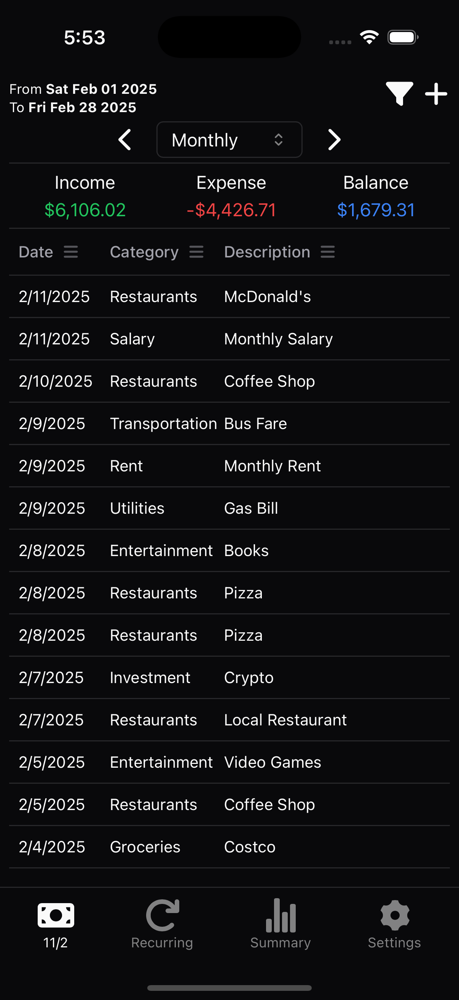

# Expense Tracker

A desktop application built with Tauri and SolidJS for managing personal finances.

## Screenshots

<table>
<tr>
  <td width="25%">
    
    <p align="center"><em>Home Page</em></p>
  </td>
  <td width="25%">
    
    <p align="center"><em>Transaction Filter</em></p>
  </td>
  <td width="25%">
    
    <p align="center"><em>Add Transaction</em></p>
  </td>
</tr>
  <td width="25%">
    
    <p align="center"><em>Recurring Transactions</em></p>
  </td>
<tr>
  <td width="25%">
    
    <p align="center"><em>Edit Recurring Transaction</em></p>
  </td>
  <td width="25%">
    
    <p align="center"><em>Financial Summary</em></p>
  </td>
  <td width="25%">
    
    <p align="center"><em>Settings</em></p>
  </td>
</tr>
</table>

## Features

- **Transaction Management**

  - Track income and expenses
  - Manage recurring transactions
  - Verify and categorize transactions
  - Filter and search transactions

- **Financial Analysis**

  - View income/expense summaries
  - Interactive charts and visualizations
  - Category-based analysis
  - Custom date range filtering

- **Automation**

  - Execute commands via clipboard
  - Automated recurring transaction processing
  - Bulk transaction operations

- **Data Management**
  - Local SQLite database
  - Data backup and restore
  - CSV export/import

## Setup

### Prerequisites

1. Install [Node.js](https://nodejs.org/) (v16 or later)
2. Install [Rust](https://www.rust-lang.org/tools/install)
3. Install [pnpm](https://pnpm.io/installation)

### Development

1. Install dependencies:

   ```
   pnpm install
   ```

2. Start development server:

   ```
   pnpm tauri dev
   ```

3. Start development for iOS:

   - [Prerequisites](https://tauri.app/start/prerequisites/#ios)

   ```
   xcrun simctl boot <simulator_id>
   # e.g. xcrun simctl boot 1585D182-0000-4000-8000-000000000000
   pnpm tauri ios dev <device_name>
   # e.g. pnpm tauri ios dev "iPhone 15 Pro"
   ```

### Building

Build for production:

```
pnpm tauri build
```

Build for iOS:

```
pnpm tauri ios build
```

## Configuration

The application can be configured through the settings menu or by editing the configuration files:

- Currency settings
- Date format preferences
- Backup intervals
- Theme customization

## Clipboard Commands

The application supports automation through clipboard commands. Commands must be prefixed with the clipboard command prefix and contain valid JSON data.

Example command format:

```
clipboard-cmd:{
  "action": "create:transaction",
  "payload": {
    "amount": 100,
    "transaction_date": 1739146213000,
    "category": "Groceries",
    "description": "Weekly shopping"
  }
}
```

## License

MIT
